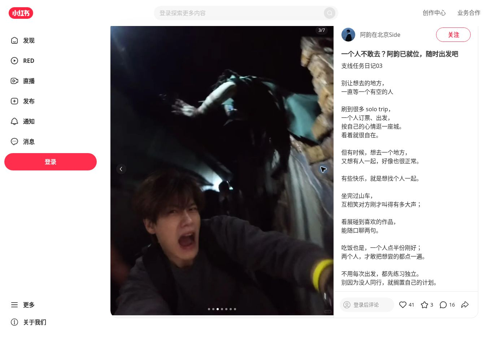
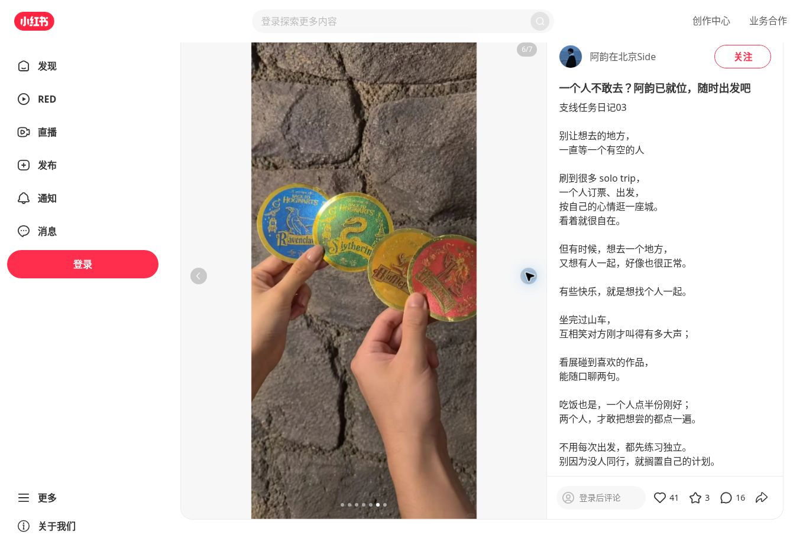

# 一个人不敢去？阿韵已就位，随时出发吧

## 来源与完整性

- 平台：小红书；账号：阿韵在北京Side。
- 笔记编号：`6aaba891000000002601d477`。
- 来源：https://www.xiaohongshu.com/explore/6aaba891000000002601d477（归档链接去除了临时签名参数；重新访问可能需要新的分享链接）。
- 读取时间：2026-09-18T14:33:45.720Z。
- 页面发布时间原样记录：昨天 18:43 北京；未将相对日期推断成绝对日期。
- 方式：浏览器读取公开可见正文、逐张翻阅图片并保存网页截图。
- 完整性：标题、正文、7个话题已读取；7/7张配图已逐张查看并留存网页截图；**没有下载原始图片文件**。
- 互动快照：点赞41、收藏3、评论16。不是浏览量或有效咨询数；不据此推断获客效果。
- 未获取：原图、绝对发布时间、后台浏览量、私信与成交数据。未归档评论用户资料。
- 本页为已发布笔记的来源档案；人物自述保持原文，不自动转为已验证人物档案或现行服务规则。

## 原文（保留换行与原有措辞）

支线任务日记03
	
别让想去的地方，
一直等一个有空的人
	
刷到很多 solo trip，
一个人订票、出发，
按自己的心情逛一座城。
看着就很自在。
	
但有时候，想去一个地方，
又想有人一起，好像也很正常。
	
有些快乐，就是想找个人一起。
	
坐完过山车，
互相笑对方刚才叫得有多大声；
	
看展碰到喜欢的作品，
能随口聊两句。
	
吃饭也是，一个人点半份刚好；
两个人，才敢把想尝的都点一遍。
	
不用每次出发，都先练习独立。
别因为没人同行，就搁置自己的计划。
	
如果刚好来北京，可以找个地陪。
就像给自己找了一个刚好有空、
本地的贴心好朋友。
提前说好想去哪玩，
让收藏夹里的某一个“想去”，变成“去过”。
	
我是阿韵，04年男大，
身高190，ENFP快乐小狗，运动阳光
	
📌 关于我
喜欢 Citywalk、看展、喝咖啡、寺庙，
熟悉北京大街小巷
纯绿色 · 纯陪伴 · 文明出行
本人直男，男生勿扰
	
#哈利波特 #来一场说走就我走的旅行吧 #一起出发吧 #一个人也要勇敢出发 #临时起意才是真的出发 #地陪 #男大

## 配图网页截图

截图保留页面界面、页码与互动快照，用于风格研究和来源核对。不是可复用的高清原图。

### 图1：侧身人物与魔法商店场景

### 图2：持饮料的人物全身照

### 图3：惊吓表情与场景角色

### 图4：红色灯光下的合影

### 图5：夜景人物自拍

### 图6：主题纪念物细节

### 图7：餐饮场景

