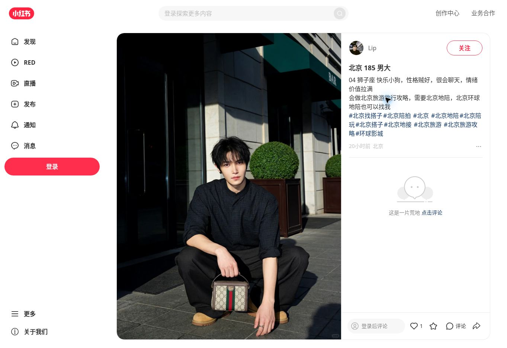

# 北京 185 男大

## 来源与采集记录

| 字段 | 内容 |
| --- | --- |
| 平台 | 小红书 |
| 对标账号 | Lip |
| 账号 ID | 6902ec9f000000003702b183 |
| 笔记 ID | 6ab00fb50000000028037735 |
| 来源地址（去除临时参数） | https://www.xiaohongshu.com/explore/6ab00fb50000000028037735 |
| 采集日期 | 2026-09-21 |
| 读取方式 | control-browser：读取公开笔记页面正文，并保存页面及首图截图 |
| 页面发布时间显示 | 20小时前（页面相对时间，未核验绝对发布时间） |
| 页面地区显示 | 北京 |
| 采集状态 | partial：标题、正文与10个话题已读取；首张图片及页面截图已归档；点赞与评论区状态已读取；图片总数、收藏数和明确评论总数未确认 |
| 保存范围 | 已读取文本、首图观察描述、分析、页面截图、首图截图和互动数据记录 |

本篇按用户要求收入「对标账号/Lip」。来源地址为用户提供链接去除 xsec_token、xsec_source 后的标识地址；采集使用原分享链接，未单独验证无参数地址能否直接访问。临时访问参数不入库。

## 原始内容

### 标题

北京 185 男大

### 正文

> 04 狮子座 快乐小狗，性格贼好，很会聊天，情绪价值拉满  
> 会做北京旅游旅行攻略，需要北京地陪，北京环球地陪也可以找我

以上为网页可见文字转录，分行按阅读需要整理；人物年龄、身高、性格和服务能力均为作者自述或标题标签，未独立核实。

### 话题（按页面顺序）

1. #北京找搭子
2. #北京陪拍
3. #北京
4. #北京地陪
5. #北京陪玩
6. #北京搭子
7. #北京地接
8. #北京旅游
9. #北京旅游攻略
10. #环球影城

## 图片观察记录

仅查看到首张图片：人物穿黑色衬衫和黑裤，在建筑门口蹲坐，手边放着包；画面有明显日照与阴影，属于户外日常穿搭人像。

此段是对网页显示图片的观察描述，不是作者文案。页面未显示可用翻页按钮，不能据此认定该笔记只有一张图片。已归档首图截图与页面截图；截图是网页显示分辨率，不是原始图片文件。图片总数及完整图片组仍未核验。

## 截图附件与互动数据

补充采集时间：2026-09-21T13:14:46.526Z（UTC，页面截图时间）。首次读取时互动区尚在加载，本次待页面完成渲染、关闭登录推荐弹窗后，已看到下列状态。

| 项目 | 截图中的显示 | 记录口径 |
| --- | --- | --- |
| 点赞 | 心形图标后显示1 | 点赞数1 |
| 收藏 | 星形图标旁未显示数字 | 未知，不记为0 |
| 评论 | 按钮显示“评论”；内容区显示“这是一片荒地 点击评论” | 当前页面暂无可见评论；明确评论总数未知 |
| 图片 | 当前可见1张，未见翻页控件 | 保存1张首图截图；总数未确认 |

- [页面截图（含图片、正文和互动区）](./6ab00fb50000000028037735/page.jpg)
- [首图截图](./6ab00fb50000000028037735/photo-01.jpg)
- [结构化互动与附件记录](./6ab00fb50000000028037735/capture.json)

截图保留原有画面与水印，没有换人、修图或生成补全；不含登录二维码、验证码或访问令牌。互动数据仅代表采集时页面显示，不代表获客结果。

## 内容分析（与原文分开）

- **内容类型**：人物展示与地陪服务介绍。
- **标题结构**：城市（北京）＋身高标签（185）＋身份标签（男大）。
- **正文结构**：出生年份缩写与星座 → 性格和情绪价值 → 旅游攻略能力 → 北京及环球地陪服务邀约。
- **视觉作用**：首图以人物穿搭与外貌为主要展示内容；没有从该图片核验旅游攻略或地陪服务能力。
- **话题策略**：覆盖北京地域词、搭子/陪拍/地陪等需求词、旅游攻略及环球影城场景词。
- **可参考点**：用简短标题明确人物标签，正文快速说明相处感受与服务场景。
- **效果判断边界**：本次截图显示1个点赞，评论区为空；收藏图标旁未显示数字。没有实际咨询成交数据，不能认定其获客效果。

## 缺失项与后续补充

- 图片总数、完整图片组与原始图片文件。
- 收藏数与明确的评论总数未显示，保留为未知；评论区呈现空状态，不以此代替后台统计。
- 精确发布时间。
- 实际咨询、订单或转化数据。

本条为外部对标研究材料，不自动成为 SIDE 的人物档案、服务能力证明或客户承诺。
